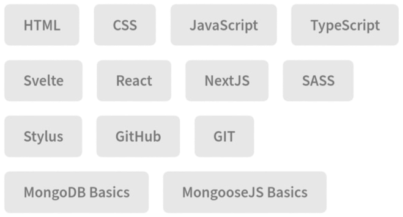

  

<h1 align="center">Hi, I'm <a href="https://flaer6.github.io/Flaer6/">Flaer</a>!</h1>
<h1 align="center">Welcome to my GitHub profile~ OwO</h1>

# Languages & Tools 👨‍💻 🛠:
 

# Contact Me :

  <strong><a href="https://flaer6.github.io/Flaer6/">Official Website</a></strong> |
  <strong><a href="https://t.me/Flaerar">Telegram</a></strong> |
  <strong><a href="https://www.instagram.com/flaerar?igsh=YTZqcWUxMGNmNm1m">Instagram</a></strong> |
  <strong><a href="https://m.vk.com/id597028138" class="home-hero__social-icon-link">VK</a></strong>

<picture>
  <source
    srcset="https://github-readme-stats.vercel.app/api?username=u3u&show_icons=true&count_private=true&include_all_commits=true&theme=dark"
    media="(prefers-color-scheme: dark)"
  />
  <source
    srcset="https://github-readme-stats.vercel.app/api?username=u3u&show_icons=true&count_private=true&include_all_commits=true"
    media="(prefers-color-scheme: light), (prefers-color-scheme: no-preference)"
  />
  
</picture>

 
 

<picture>
  <source
    srcset="https://github-readme-stats.vercel.app/api/top-langs/?username=u3u&layout=compact&theme=dark"
    media="(prefers-color-scheme: dark)"
  />
  <source
    srcset="https://github-readme-stats.vercel.app/api/top-langs/?username=u3u&layout=compact"
    media="(prefers-color-scheme: light), (prefers-color-scheme: no-preference)"
  />
  
</picture>

